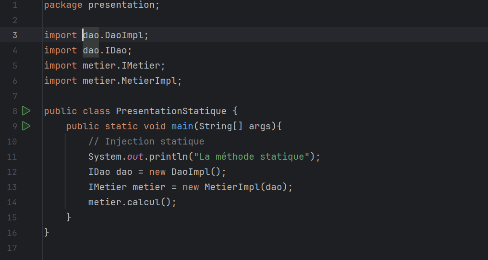

<h1 style="text-align: center;font-size: 40px;">Compte rendu</h1>

<h2>Introduction</h2>

L'objectif de ce travail est d'explorer et de mettre en pratique le principe d'injection de dépendances dans le contexte du développement logiciel en Java. L'injection de dépendances est un concept fondamental de l'Inversion de Contrôle (IoC), visant à améliorer la modularité, la flexibilité et la maintenabilité des applications.   
Dans cette première partie de notre compte rendu, nous nous concentrerons sur la compréhension et l'explication du principe de l'injection de dépendances. Nous aborderons également les différentes approches pour réaliser l'injection de dépendances, notamment l'injection par instanciation statique et dynamique, ainsi que l'utilisation du framework Spring pour gérer les dépendances de manière plus efficace.  
En résumé, notre objectif est de fournir une vision claire et concise de l'injection de dépendances, de ses avantages et de son importance dans le développement d'applications logicielles modernes en Java.  

<h2>Ennoncé</h2>
<ol>
  <li>Couche DAO  
      <ul>  <li>Interface IDao</li>
            <li> Implémentation de l'interface IDao</li></ul>
  </li>
 
  <li>Couche Métier
   <ul>  <li>Interface IMetier</li>
         <li>Implémentation de l'interface IMetier</li></ul>
 
  <li>Couche Présentation</li>
<ul>  <li>Instantiation statique</li>
      <li>Instantiation dynamique</li>
      <li>En utilisant le Framework Spring
     <ul>  <li>Version XML</li>  
          <li>Version annotations</li></ul></li>  
</ul>
</ol>

<h2>Conception </h2> 

Dans la conception d'une application Java suivant une architecture en couches, les étapes initiales consistent à définir les contrats et les fonctionnalités de chaque couche. Ainsi, la création de l'interface IDao avec sa méthode getDate permet de spécifier le contrat pour l'accès aux données, en définissant une opération pour récupérer la date à partir de la source de données. Par la suite, une implémentation de cette interface est développée, fournissant une logique concrète pour l'accès aux données.  
De manière similaire, pour la couche Métier, l'interface IMetier est définie, exposant les fonctionnalités métier de l'application via la méthode calcul. Cette interface représente un contrat pour l'exécution des opérations métier génériques. Une implémentation de cette interface est ensuite créée en utilisant le couplage faible, ce qui permet à la classe de métier de ne pas dépendre directement des détails de l'implémentation de la couche DAO, mais plutôt d'une abstraction de celle-ci.  
En ce qui concerne l'injection des dépendances, plusieurs approches sont explorées. D'abord, par instanciation statique, où les dépendances sont fournies directement lors de la création des instances de classe, souvent via des paramètres de constructeur. Ensuite, par instanciation dynamique, où les dépendances sont chargées à l'exécution, généralement à partir d'une source externe comme un fichier de configuration. Enfin, l'utilisation du Framework Spring offre une manière plus sophistiquée de gérer les dépendances. Dans sa version XML, les dépendances sont configurées dans un fichier XML, tandis que dans sa version annotations, les dépendances sont déclarées et gérées à l'aide d'annotations fournies par Spring, simplifiant ainsi la configuration et réduisant le code boilerplate. Ces différentes approches offrent une flexibilité et une modularité accrues dans le développement des applications Java.  

<h2>La structure du projet Maven  </h2> 

<ol>

<li style="font-size: 25px">Package dao
<ul  style="font-size: 20px"> <li>Interface IDao : 
       </li>
<li>Implémentation de l'interface IDao (DaoImpl) : 
</li>
</ul></li>
 
<li style="font-size: 25px">Package metier
<ul  style="font-size: 20px"> <li>Interface IMetier : 
       </li>
<li>Implémentation de l'interface IMetier (MetierImpl) : 
</li>
</ul></li>
 
<li style="font-size: 25px">Package présentation
<ul  style="font-size: 20px"> <li>Instanciation statique : 
       

<li>Instanciation dynamique : 
</li>

<li>En utilisant le Framework Spring version XML : 
</li>

<li>En utilisant le Framework Spring version Annotation : 
</li>
</ul></li>

</ol>

